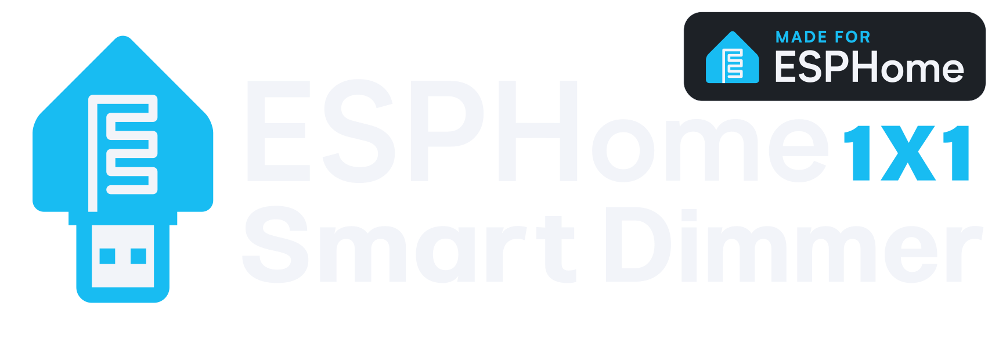
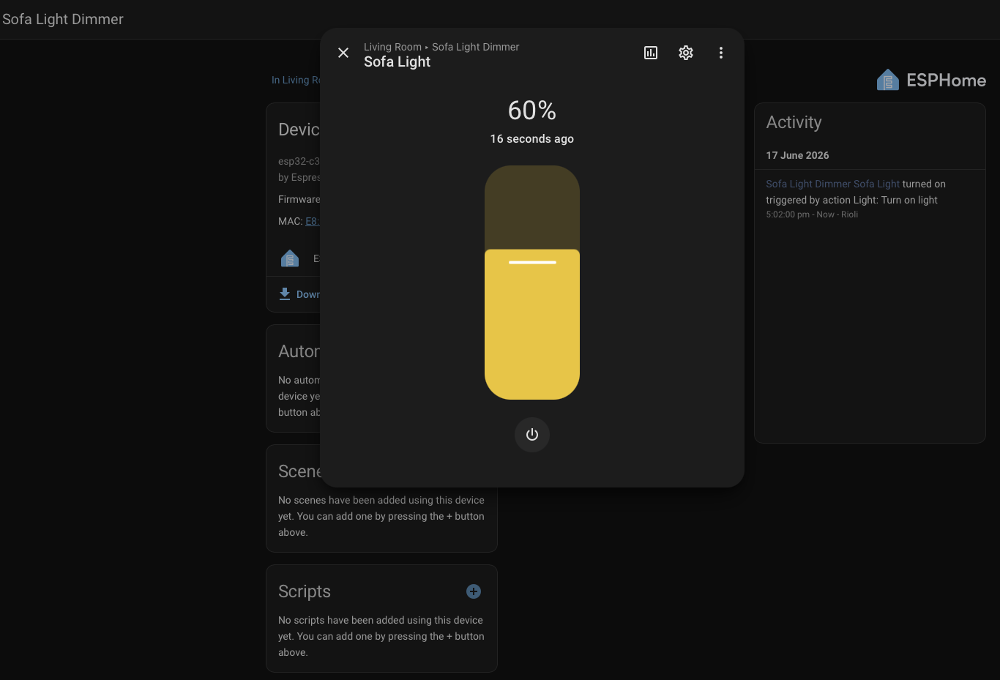

# ESPHome Smart Dimmer 1x1
ESPHome smart dimmers transform traditional USB light strips into Home Assistant smart lights. This repository includes the custom PCB design, a 3D-printable enclosure, and the ESPHome YAML configuration file.

## Screenshots

<!-- ## Demo -->
## To Get Started

### Hardware
To build this project, you will need the following components:
* **Microcontroller:** ESP32-C3
* **N-Channel MOSFET:** IRLB8721PBF
* **Gate Resistor:** 1kΩ resistor
* **USB Connectors:** 1x USB-A female, 1x USB-A male
* **PCB:** Available in the [`hardware/pcb`](hardware/pcb) directory. Compatible with any standard PCB fabrication service.
* **3D Enclosure (Optional):** Available in the [`hardware/3d model`](hardware/3d%20model) directory. It requires 2x M3 28mm screws and 2x M3 10mm screws to secure the PCB to the case.(Not the best design but it work!)

> **Note:** This design uses through-hole components to reduce assembly difficulty, so surface-mount soldering required!

### Software
1. Download or copy the configuration file located at [`firmware/esphome/dimmer-1x1.yaml`](firmware/esphome/dimmer-1x1.yaml) into your ESPHome environment.
2. Flash the firmware onto your ESP32-C3.
3. Add the newly discovered device via the Home Assistant integrations page.
4. ???
5. Profit

## FAQ

#### Did you use AI?
Yes, I used Google Gemini to fix my grammar and layout of this README.md file.

#### Do you use this device yourself?
Yes. I have produced 8 units so far, and 4 of them are actively running in my personal setup.

## Feedback
If you have any feedback, please reach out to me at **Work@rioli.net**

## Related
Same project but more port and function: [ESPHome Smart Dimmer 1x4](https://github.com/Ri0Li/ESPHome-Smart-Dimmer-1x4)

## Acknowledgements
 - [Readme.so Github](https://github.com/octokatherine/readme.so)
 - [ESPHome Github](https://github.com/esphome/esphome)

